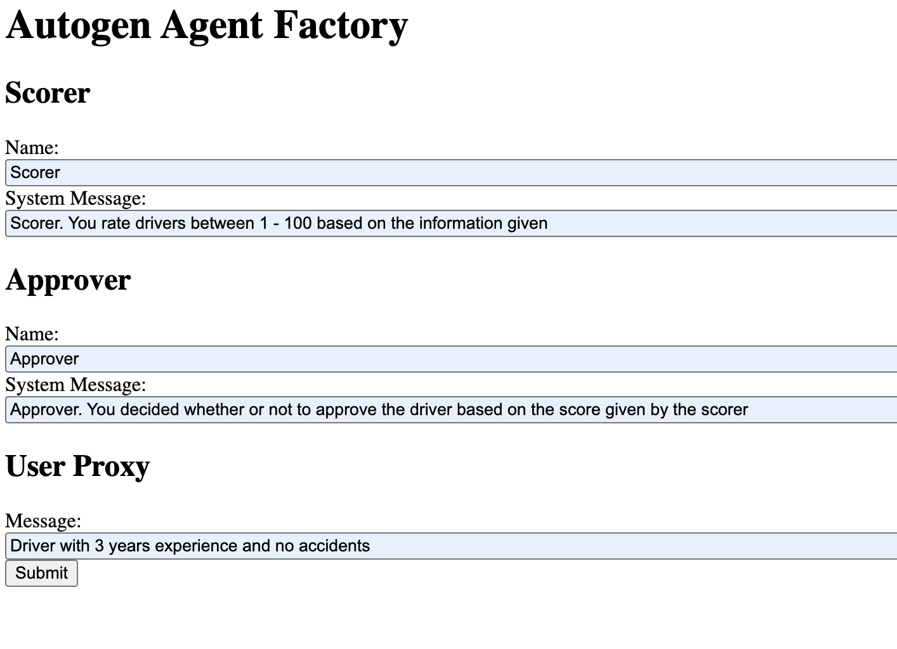

# Autogen Agent Factory

This project demonstrates an AI-driven agent factory using **FastAPI** and **Autogen**. It simulates an automated decision-making system for configuring and managing agents.

## Table of Contents
- [Overview](#overview)
- [Features](#features)
- [Technology Stack](#technology-stack)
- [Installation](#installation)
- [Running the Application](#running-the-application)
- [API Endpoints](#api-endpoints)
- [License](#license)

---

## Overview
This application provides:
1. A **FastAPI backend** that:
   - Defines and manages Agents.
   - Runs an AI workflow for evaluating agent configurations.

---

## Features
- **AI-powered agent configuration** using Autogen.
- **Workflow automation** with a decision-making pipeline:
  - *Scorer* generates a score based on input.
  - *Approver* approves or denies based on the score.
- **FastAPI for backend** to manage agents and workflows.

---

## Technology Stack
- **FastAPI** (Backend API framework)
- **Autogen** (AI agent framework)
- **Pydantic** (Data validation)
- **Uvicorn** (ASGI server for FastAPI)

---

---

## Installation
### 1. Clone the repository
```sh
git clone https://github.com/redhat-et/agent-frameworks.git
cd prototype/frameworks/autogen
```

### 2. Create and activate a virtual environment
```sh
python3 -m venv venv
source venv/bin/activate  # For macOS/Linux
venv\Scripts\activate    # For Windows
```


### 3. Set up environment variables
Rename `.env.example` to `.env` and update values as needed.

---

## Running the Application
### 1. Start the FastAPI server
```
uvicorn main:app --reload
```

### 2. Access the application
- **FastAPI API:** [http://localhost:8000/]

---

#### Example of API:
```
UI sample


```

---

## License
This project is licensed under the MIT License. See `LICENSE` for details.

---
