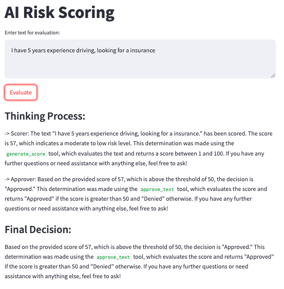

# 🐝 Bee Agent Framework for parasol demo 

The **Bee Framework** provides two ways to develop agents:  

## 1. Low/No Code UI  
  

### Pros
- Easy to use, with side-by-side editing and testing.

### Cons
1. Limited functionality:
   - Cannot call other agents within the same project.
   - Supports custom tools and can call tools in a custom agent.
2. Error messages are not intuitive:
   - Custom tools must include docstrings in the correct position with proper spacing, or they will result in a `400` error.
3. Examples screenshots:  
   
     

## 2. Developer Version for Advanced Settings  
The developer version provides more advanced customization options for building agents.

This is a customized parasol agentic workflow under bee agent framework [official documentation](https://i-am-bee.github.io/bee-agent-framework/).. 

1. initial installation of bee agent framework
[Bee Agent Framework Starter]([https://github.com/i-am-bee/bee-agent-framework](https://github.com/i-am-bee/bee-agent-framework-starter)), 
please follow bee agent starter for initial installation.

2. add custom parasol workflow `parasol.ts` into the src folder
3. run `npm run start src/parasol.ts` to start the nodejs server. expect to see output ✅ Server is running on http://localhost:3000
4. (optional) open another terminal run `curl -X POST http://localhost:3000/evaluate \
     -H "Content-Type: application/json" \
     -d '{"text": "Test input for risk evaluation"}' ` for test
5. open another terminal run `streamlit run streamlit_app.py` to play through a easy UI (http://localhost:8501). 
   
