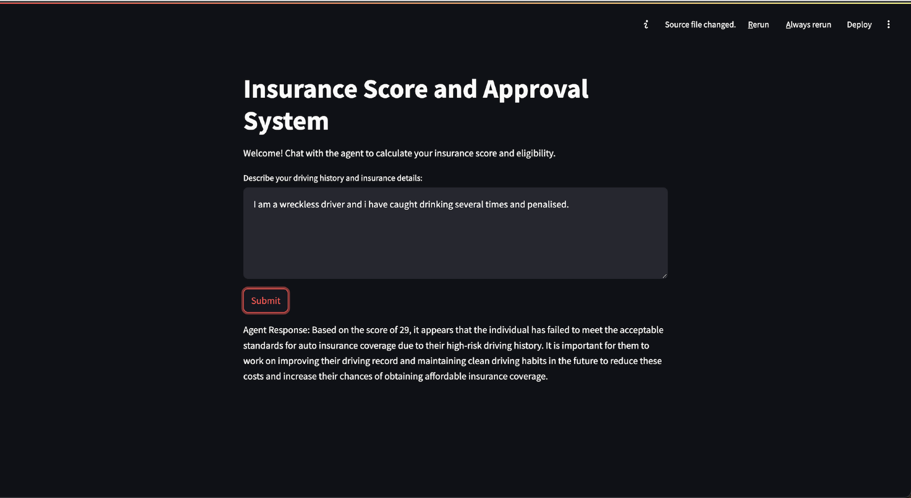

# Insurance Score API with FastAPI and Streamlit

This project is a demonstration of how to create a multi agent insurance system using the `llamaindex` package.

## Project Structure

- **FastAPI** handles the backend processing of generating insurance scores and determining approval.
- **Streamlit** provides a simple frontend to interact with the user and display the results.

### 1. Clone the repository (if applicable)

```bash
git clone https://github.com/yourusername/insurance-score-api.git
cd insurance-score-api
```
### 1. Set up environment variables:

If you are using an environment variable for the LLM model name, set it before running the FastAPI server.

```bash
export LLAMA_MODEL_NAME="mistral"  # Replace "mistral" with the model of your choice
```

### 2. Run FastAPI:

Use uvicorn to serve the FastAPI app. Run the following command from the project directory:

```bash
uvicorn main:app --reload
```

This starts the FastAPI server at http://127.0.0.1:8000 with live reloading enabled (for development).

Access FastAPI Documentation:

After starting the FastAPI server, you can visit the interactive API documentation at:

Swagger UI: http://127.0.0.1:8000/docs

### 3. Running Streamlit (Frontend)

Run the following Streamlit code to interact with the FastAPI backend:

```bash
streamlit run streamlit_ui.py
```

This will start the Streamlit app at http://127.0.0.1:8501

