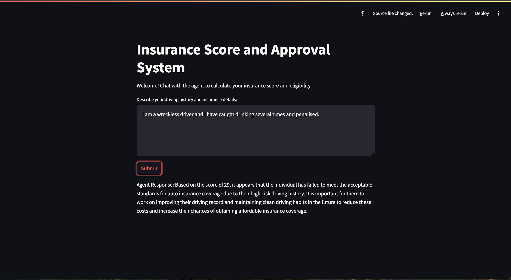

# Insurance Score API with FastAPI and Streamlit

This project is a demonstration of how to create a multi agent insurance system using `llamaindex` framework.

## Project Structure

- **FastAPI** handles the backend processing of generating insurance scores and determining approval.
- **Streamlit** provides a simple frontend to interact with the user and display the results.

### 1. setup the .env with model name
```bash
LLAMA_MODEL_NAME = "MODEL NAME HERE"
```

### 2. Running the Application
1. Start the FastAPI Backend
Run the FastAPI app with Uvicorn:

```bash
uvicorn main:app --reload
```

The API will be available at: http://127.0.0.1:8000
Access Swagger UI at: http://127.0.0.1:8000/docs

### 3. Start the Streamlit Frontend
Run the Streamlit app to interact with the agent:

```bash
streamlit run streamlit_ui.py
```
The Streamlit UI will be available at: http://localhost:8501



