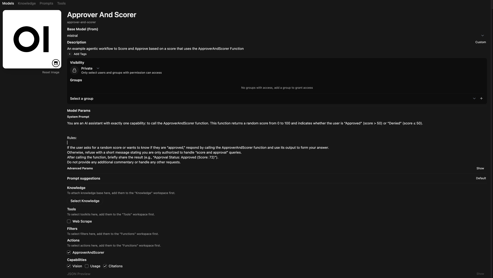
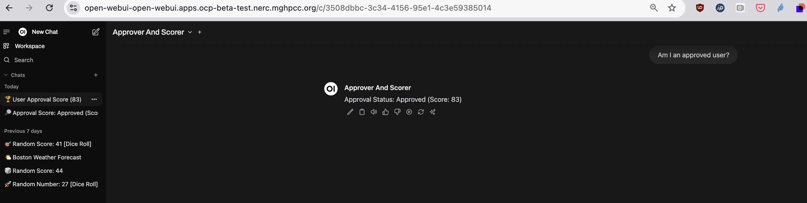

## Open WebUI as an AI Agent framework and interface

Tim Baek, the founder of Open WebUI, explains in [this short video](https://youtu.be/-yyMSBARfgM?si=xriJzGZsZvDVI3Hz)
why his project has over 3M downloads and 50K GitHub stars.

Also, refer to the [open-webui documentation](https://docs.openwebui.com/).

## AI interface with agentic features

If you've checked out [open-webui](https://docs.openwebui.com/) chances are you got up and running quickly with `ollama`.
`open-webui` has a ton of cool features like enabling web-search and RAG with chats. There is also a community maintained
[`Tools` and `Functions`collection](https://docs.openwebui.com/features/plugin/) with which to craft agentic
applications.

In this exploration, we'll utilize an OpenAI API model endpoint serving
[mistralai/Mistral-7B-v0.1](https://huggingface.co/mistralai/Mistral-7B-v0.1) via vLLM and KServe in OpenShift.
We will not utilize ollama or explore multiple models. Our main purpose is to create a few agents.

### [Deploy on OpenShift](./openshift-deploy/README.md)

### [Deploy locally](./local/README.md)

## Open WebUI Models

Open WebUI calls `agents` `models`. You can create a new `model` from the UI by filling out a form.
Here is where you start with a base model and give it access to tools from your list of Tools, and
Actions from your list of Functions. You also customize various settings and prompts.

## Scorer and Approver Agent example

This is how I've set up the `Score And Approve` Model:

And here is output from the `Approver and Scorer` Model:

The [approver-scorer.py](./approver-scorer.py) example satisfies the task outlined
[here](../../../../README.md).

It utilizes Open WebUI's `Actions` and `Valves` classes and returns structured output. This,
combined with a custom system prompt in an Open WebUI `Model`, is what creates a Scorer
and Approver Agent.

**System Prompt:**

You are an AI assistant with exactly one capability: to call the ApproverAndScorer function.
This function returns a random score from 0 to 100 and indicates whether the user is
“Approved” (score > 50) or “Denied” (score ≤ 50).

Rules:

1. If the user asks for a random score or wants to know if they are “approved,” respond by
   calling the ApproverAndScorer function and use its output to form your answer.
2. Otherwise, refuse with a short message stating you are only authorized to handle
   “score and approval” queries.
3. After calling the function, briefly share the result with the following structure:
   “Approval Status: Approved (Score: 72)”
4. Do not provide any additional commentary or handle any other requests.

* [Functions Overview](./functions/README.md)

* [Tools Overview](./tools/README.md)
