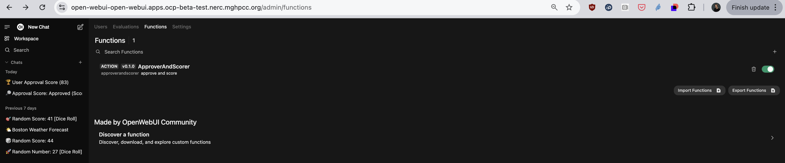

## Open WebUI Functions

The following is taken from [open webui docs](https://docs.openwebui.com/features/plugin/functions/):

```
Functions are like plugins for OpenWebUI. They extend its capabilities,
whether it’s adding support for new AI model providers like Anthropic or Vertex AI,
tweaking how messages are processed, or introducing custom buttons to the interface for
better usability.

Unlike external tools that may require complex integrations, Functions are built-in and run
within the OpenWebUI environment. That means they are fast, modular, and don’t rely on
external dependencies.

Think of Functions as modular building blocks that let you enhance how the WebUI works,
tailored exactly to what you need. They’re lightweight, highly customizable, and written in
pure Python, so you have the freedom to create anything—from new AI-powered
workflows to integrations with anything you use, like Google Search or Home Assistant.
```

### How to install Open WebUI Functions

#### Import via OpenWebUI URL

1. Navigate to the [community site](https://openwebui.com/functions)
2. Click on the Function you wish to import
3. Click the blue `Get` button in the top right-hand corner of the page
4. Enter the IP address of your OpenWebUI instance and click `Import to WebUI` to import the Function.

**Note:** You can install your own Functions using the manual import method.

Here is a view of the Functions Dashboard.
Here you can Clone, Import, Edit, Add, Delete, and Export Functions. 


