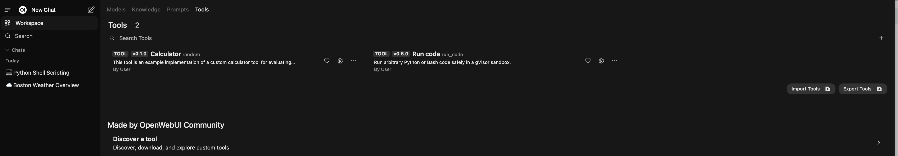

## Open WebUI Tools

Open WebUI defines tools as python scripts that are provided to an LLM at the time of the request.
Tools allow LLMs to perform actions and receive additional context as a result. The LLM must support function calling.

### How to install Open WebUI Tools

Refer to the `open-webui` [tools documentation](https://docs.openwebui.com/features/plugin/tools/#import-via-your-openwebui-url).

#### Import via OpenWebUI URL

1. Navigate to the [community site](https://openwebui.com/tools/)
2. Click on the Tool you wish to import
3. Click the blue `Get` button in the top right-hand corner of the page
4. Enter the IP address of your OpenWebUI instance and click `Import to WebUI` to import the Tool.

**Note:** You can install your own Tools using the manual import method.

Here is a view of the Tools Dashboard.
Here you can Clone, Import, Edit, Add, Delete, and Export Tools. 

