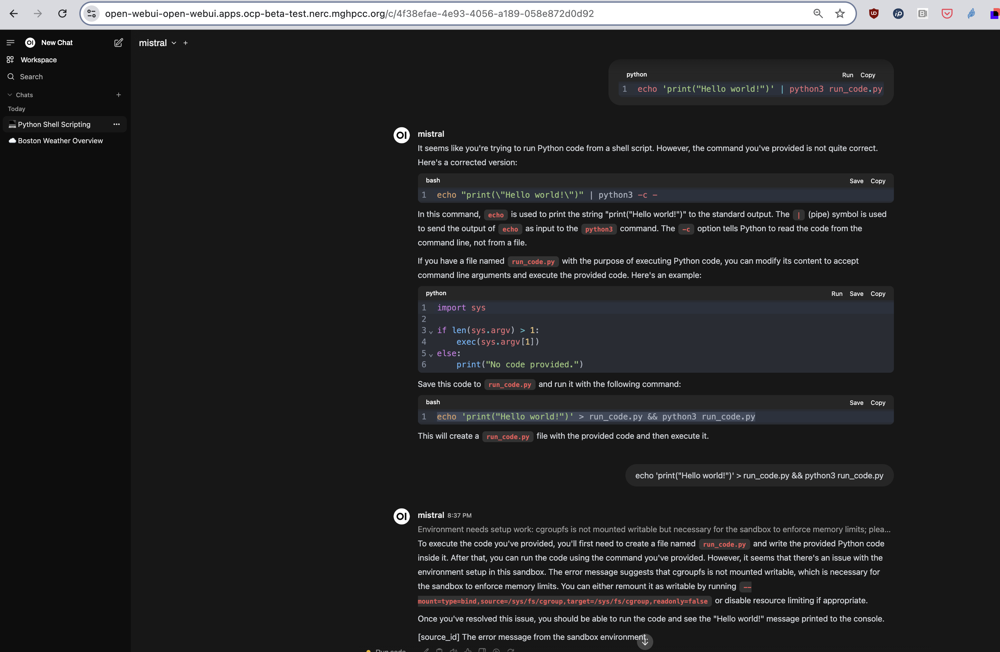
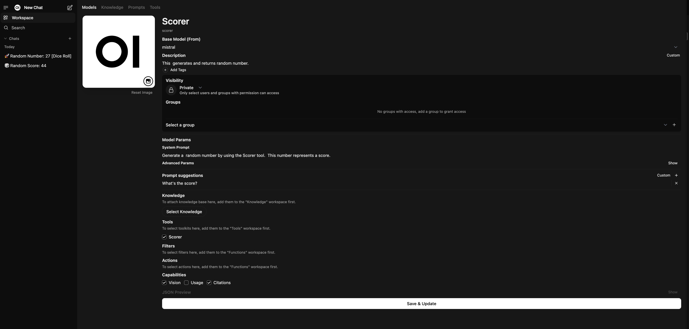

## Open-WebUI Tools

This assumes you have `open-webui` running already. If you have access to OpenShift, you can deploy
with [openshift-deploy](../openshift-deploy/README.md). To run on your local system, you
might use [local setup](../local/README.md).

### What are Tools?

Open-WebUI defines tools as python scripts that are provided to an LLM at the time of the request.
Tools allow LLMs to perform actions and receive additional context as a result. The LLM must support function calling.

### How to install Open-WebUI Tools

We'll use the `open-webui` [tools documentation](https://docs.openwebui.com/features/plugin/tools/#import-via-your-openwebui-url).

#### Import via OpenWebUI URL

1. Navigate to the [community site](https://openwebui.com/tools/)
2. Click on the Tool you wish to import
3. Click the blue `Get` button in the top right-hand corner of the page
4. Enter the IP address of your OpenWebUI instance and click `Import to WebUI` to import the Tool.

**Note:** You can install your own Tools using the manual import method.
The Tools format is very simple, it's a python script.

**Warning:** Do not import Tools you do not understand or are not from a trustworthy source.

### Tools Overview 

I installed the [run_code](https://openwebui.com/t/etienneperot/run_code/) tool (what could go wrong?)
as mentioned above. Here's a screenshot of when I tried to run code in the containerized (in OpenShift) environment:

I wasn't expecting the sandbox to work out-of-the-box but thought I'd give it a try.

Here is a view of the Tools Dashboard. Here you can Import, Edit, Add, Delete, and Export Tools. 
It's also easy to edit or clone already uploaded Tools.

## Scorer and Approver Agents

Open-WebUI calls `agents` `models`. You can create a new `model` from the UI by filling out a form.
Here is where you start with a base model and give it access to tools from your list of Tools. You also customize
the prompts.

